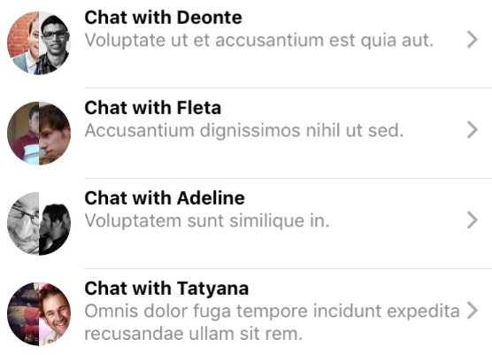

# GroupImage

A `<GroupImage />` component for React Native. A group image will be responsive
towards the amount of image it needs to display (up to four), and is commonly
used in chat application and social networks.




## Quick Start

Install via `yarn`:

```
$ yarn add react-native-group-image
```

## Usage

```jsx
import GroupImage from 'react-native-group-image'

const Foo = ({images})=> <GroupImage images={images} />

export default Foo
```

Where `images` is an array of image assets:

```json
{ uri: 'http://to.img/'}
```

For more, check out the [storybook examples](storybook/stories/index.js).

## Hacking

Run tests with `jest`:

```
$ yarn test
```

or watch tests with `yarn watch`.

Run Storybook with `storybook`:

```
$ yarn storybook
```

*Note*: you should have a host app already running,
you can point storybook at it by editing [storybook/app.json](storybook/app.json) and
placing the registered app name there.

If you don't have a host app running you can make one by doing this:

```
$ react-native init NewApp
$ cd NewApp
$ npm i -g getstorybook && getstorybook
$ react-native run-ios
```

The name `NewApp` is the one configured by default here.


# Contributing

Fork, implement, add tests, pull request, get my everlasting thanks and a respectable place here :).

# Copyright

Copyright (c) 2017 [Dotan Nahum](http://gplus.to/dotan) [@jondot](http://twitter.com/jondot). See [LICENSE](LICENSE.txt) for further details.


